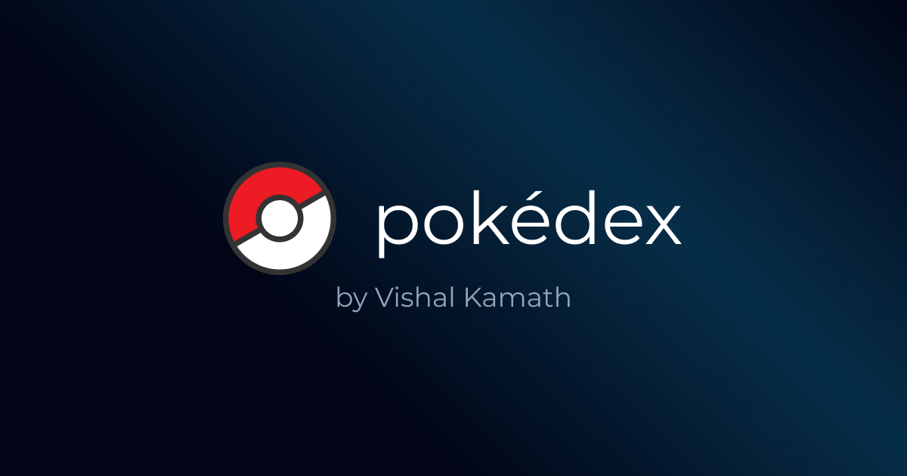

# PokéDex Website

<div align="center">
  <picture></picture>
</div>

<hr/>

## Introduction

Welcome to the PokéDex Website repository! This is a web application built using [Next 13](https://nextjs.org/blog/next-13), [Tailwind CSS](https://tailwindcss.com/), [PokéAPI](https://pokeapi.co/) and [pokenode-ts](https://github.com/Gabb-c/pokenode-ts), that provides a comprehensive collection of information about all your favorite Pokemon species.

### Website Links

- **_latest release_** - [https://pokedex-gamma-one-30.vercel.app](https://pokedex-gamma-one-30.vercel.app/)
- **_v1_** - [https://pokedex-kfigispp7-vishal-kamath.vercel.app](https://pokedex-kfigispp7-vishal-kamath.vercel.app)

## Getting Started

To get started with the project, you can simply clone the repository:

```bash
git clone https://github.com/Vishal-Kamath/pokedex.git
```

After that, navigate to the project directory and install the dependencies:

```bash
cd pokedex
npm install
```

Once the dependencies are installed, you can run the development server:

```bash
npm run dev
```

This will start the development server at `http://localhost:3000`. You can then open your browser and navigate to that URL to view the Pokedex website.

## Features

The Pokédex website provides the following features:

- Browse through a comprehensive collection of Pokémon species.
- Search for a specific Pokémon using their name or ID.
- View detailed information about each Pokemon, including their stats, abilities, moves, and evolution paths.
- Enjoy a fast and seamless user experience, thanks to the use of Next.js 13

## Acknowledgments

This project was made possible thanks to the following resources:

- [Next.js](https://nextjs.org/)
- [Tailwind CSS](https://tailwindcss.com/)
- [PokeAPI](https://pokeapi.co/)
- [pokenode-ts](https://github.com/Gabb-c/pokenode-ts)

## More about me

Hi, I'm [Vishal Kamath](https://github.com/Vishal-Kamath), a web developer striving to create beautifully designed websites. This is a fun project that I created while tinkering around with Next 13. I hope you like it!